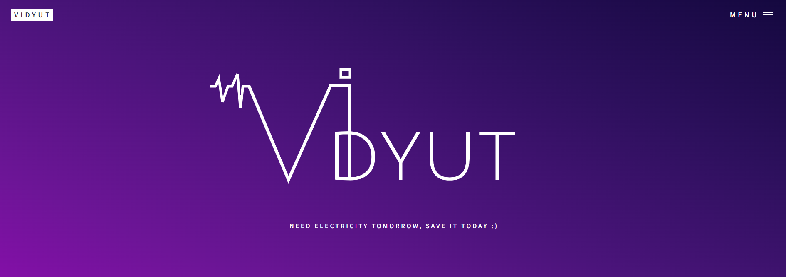

##  Link to the Website 
https://priceless-carson-ea1fc6.netlify.app/

  

## What was your motivation?
We people waste a lot of energy in our daily usage either by not turning the lights off when not in use or by utilizing old and inefficient appliances that consume large amount of energy or by not switching off the vehicle engine when the light is really long. Energy needs to be conserved not only to cut costs but also to preserve the resources for longer use.

## Why did you build this project?
Resources that are available to us today should be used economically to conserve them for future use since they are limited and will expire one day. The sad part is that we, humans, have been using these resources at such a high rate that we might end up using them much sooner. These resources such as coal, oil and gas are not sustainable. They might not be available for our coming generation. We, therefore, have a responsibility in hand to conserve and save energy as much we can to make it available.

## What problem does it solve?
5% to 10% electricity is wasted every month.
Energy conservation can be as simple as turning off lights or appliances when you do not need them.
You can also use energy-intensive appliances less by performing household tasks manually, 
such as hang-drying your clothes instead of putting them in the dryer, or washing dishes by hand.
So, we came up with a simple solution, our website will take various factors as input and 
will give results on the basis of the number of units used per month, 
we will apply ML model to analyze the data with respect to the user's locality, 
size of house no of appliances, etc and will give the target to users about the number of units to 
be used every month and if the user is able to achieve their target they will receive incentives.

## What did you learn?
There are many ways to conserve energy,  In the process of introducing you all to this new way helped us learn various new things ourselves.
The ML model based project helped us to communicate with the users to help them reduce their excess energy usage and save money at the same time.

## Frontend Built With
- HTML 5
- CSS
- JavaScript
- font: Inter
- icons: FontAwesome

## Data taken from 

https://www.kaggle.com/gireeshs/household-monthly-electricity-bill

## Machine learning Models used are 
- Linear Regression
- Lasso
- Ridge

## Tools used are
- VS code
- Jupytor Notebook
- Figma 
- MS Excel

## We used Flask for developing web app and deployed our website on netlify 

## PPT Link to get detailed idea for our project

https://www.canva.com/design/DAEwF0vSTWw/share/preview?token=rlHKrr8R4ntGi64q4qAeSw&role=EDITOR&utm_content=DAEwF0vSTWw&utm_campaign=designshare&utm_medium=link&utm_source=sharebutton

## Contributors
- Anushka Patil
- Devika Varshney
- Preeti Kumari
- Krina Panchal
## Screenshots of our website

